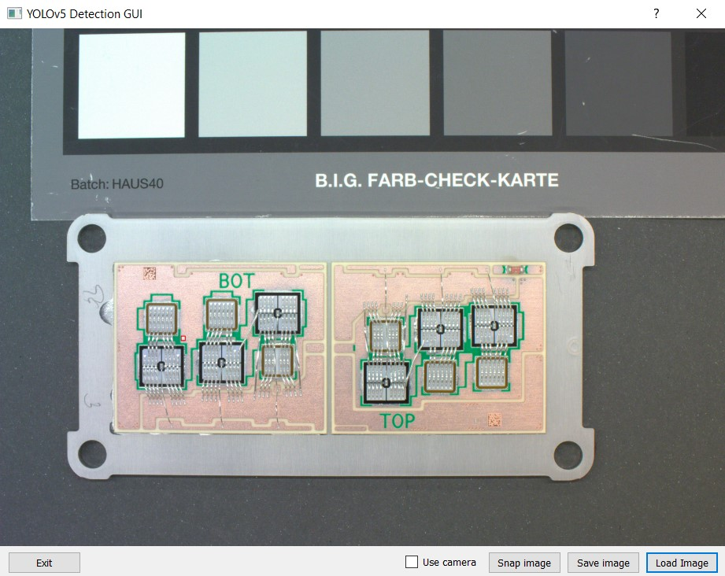

# Realizácia umelej neurónovej siete na plafrorme Raspberry Pi
Táto repository obsahuje zdrojové súbory ku bakaláskej práci, ktorej cieľom je vytvorenie umelej neurónovej siete s použitím vlastného datasetu.
## Cieľ práce
Hlavným cieľom tejto práce bola realizácia umelej neurónovej siete na detekciu kvapiek cínu na doskách polovodičových modulov. Sieť je natrénovaná na modeloch YOLOv5, pri trénovaní bol použitý model YOLOv5 medium.

*<p align="center"> Obr. 1 Výstup z detekcie s využitím modelu</p>*
Každá detekovaná kvapka na obrázku má priradenú pravdepodobnosť s akou si bola sieť istá pri detekcii.
## Dataset
Dataset je tvorený 200 obrázkami, každý z nich obsahuje aspoň jednu kvapku, zopár z nich obsahuje až 6 kvapiek. Fotografie boli zhotovené pomocou BASLER 15 MPx kamery komunikujúcej na rozhraní USB 3.0. 
## Detekcia
V zložke GUI sa nachádza grafický program, ktorý sa použil na detekciu obrázkov, buď načítaním zo súboru alebo pomocou snímania z Raspberry Pi kamery (aj keď táto funkcionalita plne nefunguje).

*<p align="center"> Obr. 2 Grafický program na detekciu</p>*
## Presnosť modelu
Presnosť modelu sa pohybuje okolo 95%, väčšie kvapky sú v poriadku detekované, model má problémy s detekciou menších kvapeek, laebo keď sa nachádzajú pod kontaktmi čipov poprípade na rezistoroch pre meranie prúdu.
## Zhrnutie
Natrénovaná sieť je vyhovujúca pre použitie v priemysle pre kontrolu dosiek a zároveň ako pomôcka na kontrolu ľudského faktoru. Model dokáže spoľahlivo detekovať väčšinu kvapiek, táto presnosť by sa mohla zvýšiť opätovým trénovaním modelu s pomocou väčšieho datasetu a využitím iného typu YOLOv5 modelu.
## Obsah repository
- GUI program na detekciu `GUI/`
- Ukázka datasetu `dataset_preview/`
- Váhy natrénovaného modelu `best.pt`

## Použitie detekcie
Model bol trénovaný pomocou oficiálnej [yolov5 repository](https://github.com/ultralytics/yolov5), detekcia je realizovaná na Raspberry Pi s použitím knižnice Torch.
Príkaz na detekciu pomocou terminalu:
```
python3 detect.py --img 1024 --source dataset_preview/0000.bmp --weights best.pt
```

*Tabuľka časov detekcie na RPi*
| Veľkosť parametra *(--img)* | Čas detekcie | Presnosť |
|-----------------------|-------------|-----------|
| Originál (4608x3288) | - | 6 kvapiek |
| 600 | 3,1 s | 0/6 kvapiek |
| 1024 | 5,2 s | 2/6 kvapiek |
| 2048 | 21,9 s | 4/6 kvapiek |
| 3072 | 53,1 s | 5/6 kvapiek |
| 4096 | 1 min 29,2 s | 5/6 kvapiek |
